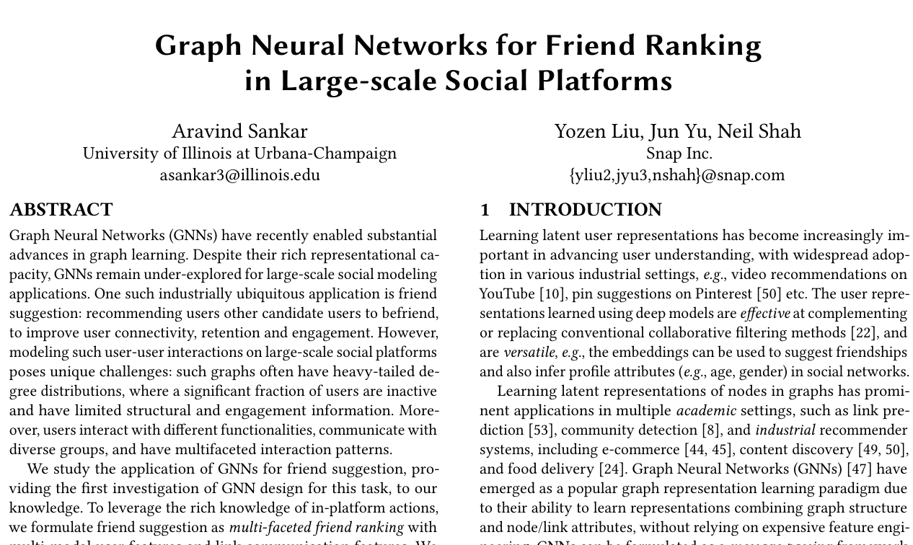
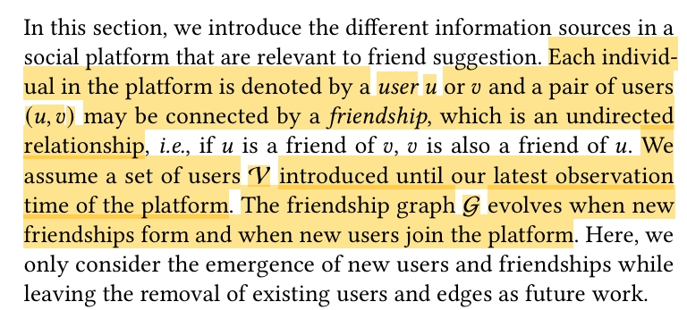
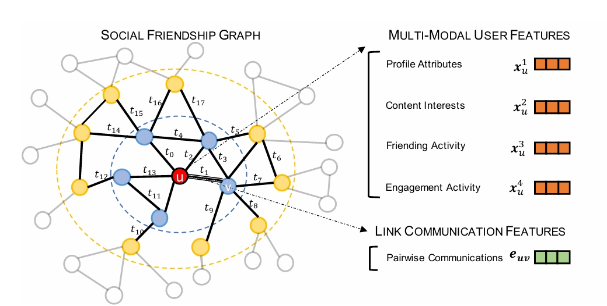

## Friend Recommendation and Ranking using Graph Neural Networks
### - [Prof. Sandeep - IITD](https://sites.google.com/view/sandeepkr/home)
### - Yadvendra Gurjar (2022EE31764)

  
  

---
# Problem Statement

  

---

# Facebook Social Circles Dataset

### Source
The dataset is provided by the Stanford Network Analysis Project (SNAP) and can be accessed at [https://snap.stanford.edu/data/ego-Facebook.html](https://snap.stanford.edu/data/ego-Facebook.html).

### Description
This dataset contains anonymized Facebook data collected from survey participants using the Facebook app. It represents the social circles (ego networks) of users, where each ego network consists of a central user (ego) and their friends. The dataset is undirected and unweighted, meaning that all connections are mutual and have no associated weights.

### Data Storage
- **Graph Representation**: The dataset is stored as a collection of ego networks, where each ego network is represented as a graph.
- **Files**:
  - `facebook_combined.txt`: Contains the edges of the combined graph, where each line represents an edge between two nodes (user IDs).
  - `ego/*.edges`: Contains the edges for each ego network, where each file corresponds to a specific ego.
  - `ego/*.feat`: Contains the features of nodes in each ego network. Each row corresponds to a node, and the columns represent binary features.
  - `ego/*.featnames`: Contains the names of the features in the `.feat` files, providing a mapping of feature indices to their descriptions.

### Key Characteristics
- **Nodes**: Represent Facebook users.
- **Edges**: Represent friendships between users.
- **Features**: Binary attributes of users, such as profile information (e.g., education, location, etc.).
- **Ego Networks**: Each ego network is centered around a specific user and includes their friends and the connections between them.

### Note:
- The data has been anonymized to protect user privacy.
- The dataset is suitable for studying the structure and dynamics of social networks.

---
## Loading the Dataset

Our data loading code will load the dataset into a single NetworkX graph. We then convert the NetworkX graph to a PyG graph object, which we feed into the GNN.

The process of loading the dataset and converting it into the required data structure for use in the Graph Neural Network (GNN) is a complex and intricate task. To streamline this process and ensure modularity, the complete implementation for dataset loading and conversion has been encapsulated in the `src.dataset` module. 

Here, we simply utilize the functionality provided by `src.dataset` to load the dataset efficiently.

# The GraFRank Model

We hope to accomplish the following goal:

**Leverage user features** $\{x_v : v\in\mathcal{V}\}$ and **friendship graphs** $\{G^k : 1 \leq k \leq 10\}$, to **generate user representations** $\{h_v \in \mathbb{R}^D : v\in \mathcal{V}\}$ that **facilitate friend suggestion** tasks of candidate retrieval and **re-ranking**.

**The specific tasks include:** 
- candidate retrieval via link prediction
- - we first generate a list of top $N$ possible friend recommendations. 
- candidate ranking through a reranking of the retrieval pool
- - we re-rank a subset of these recommendations to obtain the final top $n$ recommendations, where $n << N$.

---

## The GraFRankConv Layer

- Each modality varies in its level of graph homophily. 
- Hence, we must learn a modality-specific representation $z_u^k \in 	\mathbb{R}^D$ for node $u\in V$. 
- Thus, after the modality-specific neighborhood aggregation, we will have computed $K$ representations $\{z_{u}^1,...,z_{u}^K\}$, where $z_{u}^k \in 	\mathbb{R}^D$ for each node. 
- The GraFRankConv Layer consists of two steps: message propagation and message aggregation.

## Message Propagation:

- we aggregate the K modality features $\{\textbf{x}^k_v, v \in N(u) \} $ for node $u$. 
- To quantify the importance of "friendship" connections, we have an attention coefficient between nodes $u$ and $v$ with respect to modality $k$: $$\alpha^k(u,v)=\textrm{LeakyRELU}(\textbf{a}^T_k(\textbf{W}_1^k\textbf{x}^k_u||\textbf{W}_1^k\textbf{x}^k_v))$$ (where $||$ is concatenation and $\textbf{W}_1^k \in 	\mathbb{R}^{D_k \times D}$ is a shared weight matrix for all users). 
- We then normalize all $\alpha^k(u,v)$ using the softmax function.
- The message $m_{u\leftarrow v}^k \in \mathbb{R}^D$ propagated from user $v$ to user $u$ is $m_{u\leftarrow v}^k = W_1^k x_v^{k}$. 
- We can then compute the the embedding $z_u^k=\sum_{v\in N(u)}\alpha^k(u,v)m_{u\leftarrow v}^k$, which is the weighted average of the messages from $u$'s neighbors.

## Message Aggregation:

- We use messages from both friends and from self-connections $m_{u\leftarrow u}^k = W_1^k x_u^{x,k}$. 
- The self connections are for keeping information of the original features. 
- We transform the concatenated embedding (ego-network and self-representation) through a dense layer $F_{\theta}^k$, defined by:

$z_u^{k, (L)} = F_{\theta}^k\big(m_{u\leftarrow u}^k, z_u^{k, (L - 1)}\big)\\
= \sigma\big(W_a^k\big(z_u^{k, (L-1)}||m_{u\leftarrow u}^k \big) + b_a\big)$

$W_a^k \in \mathbb{R}^{D \times D}$, $b_a, \in \mathbb{R}^D$ are trainable parameters of the aggregator, $L$ denotes the current layer, and $\sigma$ denotes the ELU activation function which allows messages to encode both positive and small negative signals.

  

---

## Splitting the dataset (**Transductive Split**)

- Need test train and validation split. 
- But splitting a graph is a non-trivial task (*especially for link prediction*)

### Supervision Edges
We try and do is hide different edges from GraFrank at test, validation and train time, so that it never learns to use those edges or about their existence when it is training. We can then predict these unseen edges to calculate the loss. These unseen edges are known as supervision edges. 

### Message Edges
However, we still need some edges in order to aggregate information in the graph. These retained edges will not be used for supervision and will exist only for message passing, and are thus known as message edges.

Step-by-step:

- At training time: only the training message edges are seen by the GNN and used to predict the with the training supervision edges.
- At validation time: only the training message edges and training supervision edges are seen by the GNN, and the validation supervision edges are predicted.
- At test time: the training message edges, training supervision edges and validation supervision edges are seen by the GNN, and the **test supervision edges are predicted** (and therfore unseen).

This is known as a transductive split due to the disjoint nature of each edge set with each other
